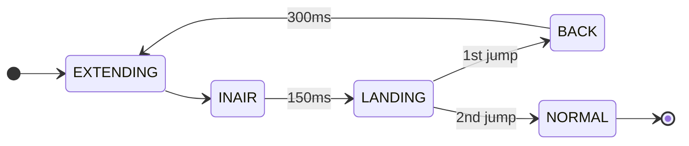
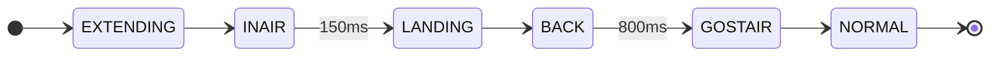

## 完整形态调试

### 运动

花了比较多时间尝试重心、位移与摆角的关系，在关闭位移的情况下起身，发现会往后冲，需要扶一下才能把摆角摆回来，在摆角摆到平衡点`theta_eq` 后，观察是否往后往前快速溜车，最后调节得到较好的平衡位置为拟合值的3/4，但是后来配合参数发现其实相差不多，在低腿长的时候比较需要

发现在同套参数下会出现不同的表现，可能与操作、部分策略的微小差异有关。

```matlab
Q = [60 40 40 20 1600 70 1600 70 10000 80]
R = [10 10 1 1]
```

1. 这套参数完全是无意中写出来的，恰好yaw少了1个0，在不加里程计起身的时候非常平稳
2. 高腿长一定加速度运动就出现了腿前后摆的问题
3. yaw加了1个0之后，不加里程计起身会出现直接向后冲的情况，上面测得的情况可能是由这个导致的
4. 在某一次切版本时，高腿长运动较好，但是飞了两次坡+切版本再改之后，运动就出现2中的问题

在调上面的同时，发现之前DAP烧录第一次上电后烧不进去的问题突然解决了，来回切版本可以稳定复现问题的是否发生。

```matlab
Q = [60 100 80 20 1600 70 1600 70 10000 80]
R = [10 10 1 1]
```

1. 这套参数为跑圈时的参数，且跑圈将yaw提高到了200、400
2. 起身必须加里程计，但是会出现磕到地板，然后向前摆，摆动后才收敛的情况
3. 在高腿长下运动表现较好

高腿长出现会快速向后的情况

![[记录.png]]
![[记录-1.png]]

![[记录-2.png]]

观察到 $v_{ref}$ 会变小，发现是 `slope` 斜率设置减到负数了。

通过加i消除了roll的pd静差，d项依然使用速度

### 离地检测

前天在采用重力补偿前馈之后，通过腿输出沿杆力的大小判断是否离地，初次在小坡上连续测试，效果还可以，但是飞坡+重复测试后，还是有问题

1. 在出坡落地的时候，容易触发二次离地
2. 在下台阶的时候，触发二次离地
3. 踩大弹丸，触发离地

为了计算气弹簧的等效支持力，采用在不同腿长下采集VMC逆解算F真实值数据，直接交给Claude拟合得到下面的结果，可以看到对F的拟合基本能够得到核心值，包络基本能覆盖原有数据的值

![[curve.png]]

![[pendulum_symmetric_fit.png]]

同时，也计算了等效支持力、等效补充力矩

![[FT_torque_compensation.png]]

但上面的拟合结果对左右腿展现出较低的对称性，原因可能有

1. 左右腿标定存在差异，在控制时也可以发现两边腿长存在稳定相差值2cm，可能导致解算的力与控制的力不同，且存在roll轴差异，2cm近似为弧长刚好大约1度
2. 机械结构不稳定产生的偏差，右腿会出现很明显能够掰动的情况

![[curve-1.png]]

发现还是会触发二次离地，如果增加0.6s阈值关闭离地检测，会有比较好的效果
### 飞坡

主要是高腿长下加速困难，如果太快容易不收敛，但是太慢难以抵抗上坡减速

调参后在高腿长下加速能够稳定，但是发现出坡姿态比较差，还是会撞到坡

如果先低腿长加速，到进坡前再增加腿长，即往斜前方推遥控器，出坡姿态会更好。但是更好也是机身还不平衡，后面可以尝试把摆杆和pitch调硬一些。

在将离地检测改为时间锁定0.6s之后能够实现3次飞坡完成

### 一级台阶

比较顺利

### 二级台阶

![[curve-2.png]]

刚开始采用连跳两级的策略，但是非常难手操，尝试多次只成功了一次


之后改为跳+跪策略，成功率大大提升，且触发增益具有容错，但是仍然无法实现三次连续稳定成功


1. 在伸腿前固定速度 0.7m/s 把拨杆拨到卡住位置保持一致性，在导轮距离台阶约8-10cm起跳
2. 在BACK阶段，提高腿长的同时给恒定向前速度 0.12m/s

## 联盟赛调试

### 基础运动


![[curve-4.png]]

观察到在后退停车时，车会往前溜

### 陀螺与陀螺平移

![[curve-3.png]]

+ 在小陀螺速度较快时，会出现几乎所有和腿相关的量不收敛
+ 上面的情况由右腿太松，导致两条腿的差异很大

![[curve-7.png]]

gyro反馈10rad/s状态下，还算稳定，但是也可以观察到所有量都在正弦波动，说明为小陀螺正常情况，这里是添加了侧向力补偿，同时调了一下腿长和roll。

![[curve-6.png]]

小陀螺平移的时候会出现所有量不收敛

![[curve-8.png]]

降低小陀螺转速后其实更为明显

## UL

1. 升级裁判系统
2. 发现yaw 的 `int16_t` 写成了 `uint16_t` , 控制效果发生很大差异，调参后解决
3. 固态继电器存在使用寿命，达妙电机有较高的容值，可能使电机无法正常下电，仅进入欠压
4. 小陀螺时关闭卡尔曼滤波器，使用轮速计进行 `v,x` 估计，能一定程度解决小陀螺偏心问题 

## 4.11-4.16

### 卡死

加入大量UI后发现单片机上电之后卡死，将每次发送信息时的

```C++
inline void SendData(uint8_t* data, uint16_t len)
{
	SCB_CleanDCache_by_Addr((uint32_t *)data, len);
	HAL_UART_Transmit_DMA(&huart1, data, len);
}
```

修改为先放入缓冲区，再发送

```C++
inline void SendData(uint8_t* data, uint16_t len)
{
	USART_Transmit(&huart1, data, len, USART_MODE_DMA);
}
```

```C++
void USART_Transmit(UART_HandleTypeDef *huart, uint8_t *pData, uint16_t Size, enum USART_Mode mode)
{
  memcpy(TxBuffer, pData, Size);
  switch (mode)
  {
  case USART_MODE_BLOCK:
    SCB_CleanDCache_by_Addr((uint32_t*)TxBuffer, Size);
    HAL_UART_Transmit(huart, TxBuffer, Size, 100);
    break;
  case USART_MODE_DMA:
    SCB_CleanDCache_by_Addr((uint32_t*)TxBuffer, Size);
    HAL_UART_Transmit_DMA(huart, TxBuffer, Size);
    break;
  case USART_MODE_IT:
    break;
  default:
    break;
  }
}
```

同时，删除了USBX之后，USB冗余逻辑删除，底盘内存占用降低，之前的烧录卡死问题不再出现。怀疑是USB冗余逻辑在擦除不够干净时会进入但是没有USB设备初始化成功，导致烧录卡死。UI应该就是缓冲区溢出导致卡死。

### 打滑与抖动

![[curve-9.png]]

![[curve-19.png]]

这个问题在修改支持力的时候也发现了，关闭roll轴之后有很大改善

![[curve-23.png]]
### 小陀螺+平移

![[curve-10.png]]

![[curve-11.png]]

切换到简易轮速计之后发现，其实v的抖动本质上还是由两轮差速引起的，而且使用轮速计会出现第二次及之后的小陀螺都会不收敛的情况。

![[curve-12.png]]

![[curve-13.png]]

依然可以看到alpha出现摆动且两条腿之间的差距较大，这也可能导致两边轮速不一致

![[curve-14.png]]

逐步调大dalpha权重后效果会好一些

![[curve-15.png]]

在小陀螺途中出现莫名抖动，在减小v,x,alpha权重后大致解决了抖动

![[curve-16.png]]

观察到x解算在小陀螺关闭瞬间会出现突变

![[curve-17.png]]

使用以下策略解决了上述问题

![[curve-18.png]]

首先在退出小陀螺时直接重置里程计，我觉得这是必要的，因为yaw轴高速转动会对里程计造成较大的影响

然后通过yaw速度判定退出小陀螺时机，此时重置x目标值，并缓降yaw避免出现由于大幅度江都速度导致的alpha大幅度摆动

```C++
if (fabs(yaw_updater.GetVal()) > 1.0f)
{
	maintained_x = false;
	cmd.x = pendulum_data.x;
	cmd.dyaw = yaw_updater.UpdateVal(0.0f);
}
```

修改里程计之后，发现效果不如从前，平移会偏移的比较大，在检测到yaw速度过快的时候，直接关闭a_x之后，效果会好很多，尤其是原地的时候。

![[curve-22.png]]

但是现在就是平移不走直线了，添加了离心力补偿后效果就会比较好，不需要对里程计进行额外修改，能够最大程度保持抗打滑性能。

```C++
ins.accel[0] += imu_offset_x * ins.gyro_y * ins.gyro_y;
```

最后直接在IMU EKF之前就对加速度进行处理，会更合理一些。

```C++
imu_handler->ReadAccData(&imu_handler->acc_data);
imu_handler->ReadGyroData(&imu_handler->gyro_data);
imu_handler->acc_data.x += chassis::imu_offset_x*imu_handler->gyro_data.z*imu_handler->gyro_data.z;
qekf.UpdateKalman(
	imu_handler->gyro_data.x, imu_handler->gyro_data.y, imu_handler->gyro_data.z,
	imu_handler->acc_data.x, imu_handler->acc_data.y, imu_handler->acc_data.z,
	DWT_GetDeltaT(&INS_Count)
);
```

### 支持力

加入了气弹簧力的建模，哎之前就是只映射了力矩，而没有映射到力，不然其实也能得到相似的结果。

发现之前里程计写错了。

```C++
float a_body[4] = {0, _acc[0], _acc[1], _acc[2]};
```

之前没有加前面的0，导致最后融出来的az在0附近，同时这也导致前面调出来的参数得重新调了

![[curve-20.png]]

在修改过错误之后，发现左右腿不一样，关闭roll修正后相同

发现将roll的速度项关闭之后，也是正常的，怀疑是输出量纲导致的问题

![[curve-21.png]]

![[curve-24.png]]

![[curve-25.png]]

小陀螺时支持力解算会阶跃减小，发现是VMC解算出来的力也减小，观测之后发现确实似乎还挺正常的

![[curve-26.png]]

在不打开离地检测的时候，让车过了一下坡，测得上面的结果，选中N和F作为判据，尝试判断

采用的判据为

```C++
offground = (N<0.0f) && (lpendulum.Freal<-100.0f) && (rpendulum.Freal<-100.0f);
```

```C++
landing = (N>50.0f) && (lpendulum.Freal>-100.0f) && (rpendulum.Freal>-100.0f);
```

![[curve-27.png]]

测得效果如上，加入离地检测

![[curve-28.png]]

第一次离地与落地效果如上，出现了二次离地

![[curve-29.png]]

![[curve-30.png]]

将腿长重置为最短腿长，重复两次得到结果较为稳定

![[curve-31.png]]

但是重启之后重复，又出现了二次离地

![[curve-32.png]]

加了缓震，会好一些，有时候出现二次但是表现上看不太出来

不是tmd什么时候谁告诉你 `wheel_mass=15.0f` 的啊，调屁重调

![[curve-33.png]]

![[curve-34.png]]

不主动伸腿，在落地时主动收腿，恰好可以达到最短腿长，但容易出现上面这种二次离地后退不出来的情况

![[curve-35.png]]


![[curve-36.png]]

### 起身

![[curve-37.png]]


## 发散问题

### odometry

![[curve-38.png]]

![[curve-39.png]]

![[curve-40.png]]

随着时间推移，踩小弹丸出现的振动逐渐加强

![[curve-43.png]]

![[curve-44.png]]
### lqr

![[curve-42.png]]

![[curve-41.png]]

### 执行频率

![[curve-45.png]]


## 五邑调试

### 自瞄

1. USB不稳定，TF树消失的问题仍然存在
2. 自瞄如果能够稳定使用，自瞄效果还可以
3. 有概率可以开小符，大符比较困难

![[experiments.png]]


### 运动

运动问题比较大，很难长时间、高机动性运行

1. 在起身、左右平移、打滑情况下，容易出现超功率
2. 现在给定水平方向速度，pitch倾角较大
	1. 这个问题导致了在向前加速、向后减速的时候容易卡住东西，容易撞到
	2. 有可能是物理建模、代码中存在某些处理不对导致的，需要排除
		1. 删除平衡点，发现无效
		2. 使用纯上交模型，不作任何更改，需要尝试
		3. 有可能轮毂限幅不对，需要修改
	3. 解决这个问题，有可能发散性问题会解决
	4. 注意到腿的髋前后和之前以为的颠倒，有可能是这个问题导致的
3. 小陀螺平移
	1. 给大轮权重后，看似普通运动效果较好，但会导致平移方向错误
	2. 小陀螺平移、小陀螺踩弹丸，在一段时间后会发散
4. 离地检测与缓冲还需要优化

### 操作

1. 由于运动问题，现在操作手感不好
2. 在操作的时候，没有注意车道线，一直在撞车
3. 忘记开小陀螺

### 经验

1. 多踹、多撞、多跑，之前在家测得还是太温和了，场地太友好了
2. 尽量多打，能打则打