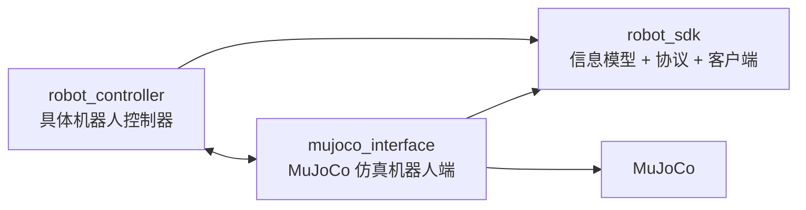
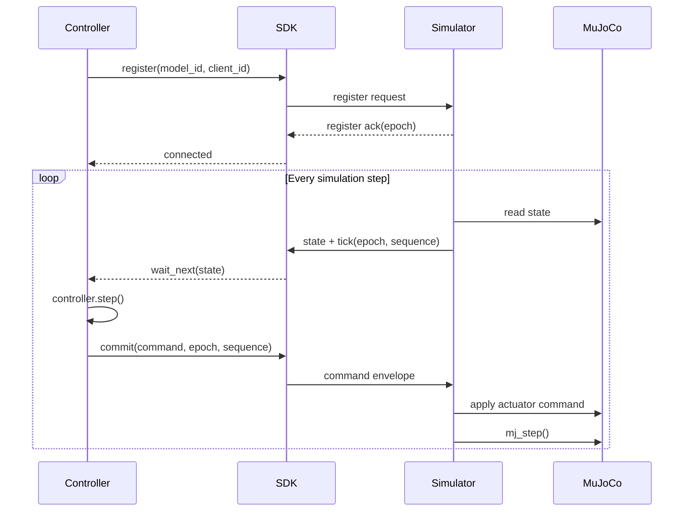
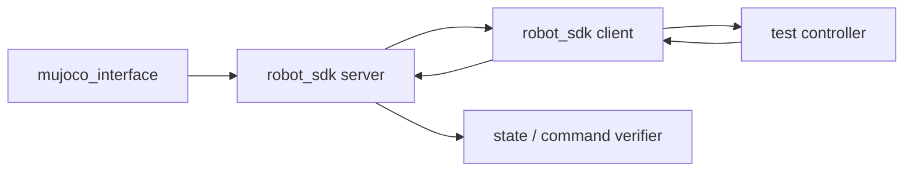

# Robot SDK 与 MuJoCo 控制链路重构设计

> [!abstract] 文档目标  
> 本文定义 `robot_sdk`、`mujoco_interface` 与 MuJoCo 侧控制器应用之间的职责边界、依赖关系、通信契约和渐进式重构路径。
> 
> 当前阶段仅考虑：
> 
> 1. 通用机器人 SDK；
>     
> 2. MuJoCo 仿真服务端；
>     
> 3. 运行在 Linux 进程中的机器人控制器。
>     
> 
> 本文暂不处理 STM32、嵌入式控制器编译、强化学习推理引擎、ROS2 以及真实机器人通信，但接口设计不得阻断这些方向。

---

## 设计结论

系统拆分为三个独立组件：

```text
robot_sdk
mujoco_interface
robot_controller
```

其中 `robot_controller` 当前可以由 `wbr_mujoco` 承担，后续也可以是四足、人形、机械臂等其他机器人的控制器项目。

依赖方向必须固定为：



`robot_sdk` 不允许依赖：

- MuJoCo；
    
- MJCF；
    
- YAML；
    
- GLFW；
    
- `mujoco_interface`；
    
- 任意具体机器人控制算法。
    

`mujoco_interface` 依赖 `robot_sdk`，将 MuJoCo 模型模拟成一个符合 SDK 通信契约的机器人。

控制器同样只依赖 `robot_sdk`。控制器不应包含 MuJoCo API、eCAL 底层调用或仿真模型名称映射。

---

## 当前问题

当前 `mujoco_interface` 同时承担了以下职责：

1. MuJoCo runtime；
    
2. 模型和 sensor 绑定；
    
3. Tick/Commit 同步；
    
4. eCAL transport；
    
5. `robot::state` 和 `robot::command` 数据定义；
    
6. 控制器使用的 client API。
    

现有 `types.hpp` 已经定义了电机、IMU、状态和命令结构，因此它实际上承担了 SDK 信息契约的职责。

现有 eCAL 模块同时提供 server 和 client，说明 transport 也已经具备从仿真器中独立出来的条件。

当前 `wbr_mujoco` 的控制器通过 `ecal_io.cpp` 将 `mujoco_interface::protocol::state_envelope` 转换为控制器内部状态，再将电机力矩转换为 command envelope。该文件已经是事实上的 SDK adapter，但仍直接依赖 `mujoco_interface` 的头文件。

因此，重构的核心不是重新实现通信，而是把已经存在的公共契约从 `mujoco_interface` 中提取出来。

---

## 职责边界

|组件|应负责|不应负责|
|---|---|---|
|`robot_sdk`|状态、命令、模型描述、消息协议、版本校验、client/server channel API、可选 eCAL transport|MuJoCo stepping、MJCF、YAML 模型绑定、具体控制器|
|`mujoco_interface`|模型加载、仿真 stepping、viewer、headless、sensor 读取、actuator 写入、Tick/Commit 调度、YAML 绑定|定义独立于 SDK 的机器人协议、包含具体机器人控制逻辑|
|`robot_controller`|状态估计、FSM、LQR、VMC、PID、RL policy、机器人特定的 observation/action|MuJoCo API、模型 sensor 名称查询、eCAL 底层 publisher/subscriber|

必须满足以下约束：

```text
robot_sdk      不知道 MuJoCo 是否存在
controller     不知道对端是真机还是仿真
mujoco_interface 不知道控制器内部使用 LQR、VMC 还是 RL
```

---

## 仓库结构

### robot_sdk

```text
robot_sdk/
├── include/robot_sdk/
│   ├── core/
│   │   ├── ids.hpp
│   │   ├── motor.hpp
│   │   ├── imu.hpp
│   │   ├── sensor.hpp
│   │   ├── state.hpp
│   │   ├── command.hpp
│   │   ├── model.hpp
│   │   └── status.hpp
│   ├── protocol/
│   │   ├── version.hpp
│   │   ├── envelope.hpp
│   │   ├── registration.hpp
│   │   ├── tick.hpp
│   │   └── codec.hpp
│   ├── channel/
│   │   ├── client.hpp
│   │   └── server.hpp
│   └── transport/
│       └── ecal.hpp
├── src/
│   ├── protocol/
│   ├── channel/
│   └── transport/ecal/
├── tests/
├── examples/
└── CMakeLists.txt
```

建议提供以下 CMake targets：

```text
robot_sdk::core
robot_sdk::protocol
robot_sdk::channel
robot_sdk::ecal
```

其中：

```text
robot_sdk::core
```

必须无第三方依赖。

```text
robot_sdk::ecal
```

可以依赖 eCAL，但不得让 eCAL 反向污染 `core` 和 `protocol`。

### mujoco_interface

```text
mujoco_interface/
├── modules/
│   ├── runtime/
│   │   ├── simulation
│   │   ├── barrier
│   │   ├── command_arbiter
│   │   └── metrics
│   ├── binding/
│   │   ├── config_loader
│   │   ├── model_binding
│   │   ├── sensor_binding
│   │   └── actuator_binding
│   ├── endpoint/
│   │   └── sdk_server
│   ├── input/
│   └── viewer/
├── config/
├── tests/
└── CMakeLists.txt
```

建议提供：

```text
mujoco_interface::runtime
mujoco_interface
```

不再向下游控制器暴露 MuJoCo runtime static library。控制器只链接 `robot_sdk`。

### robot_controller

以当前 WBR 控制器为例：

```text
wbr_mujoco/
├── controller/
│   ├── include/
│   └── src/
├── runtime/
│   ├── sdk_io.cpp
│   ├── app.cpp
│   └── main.cpp
├── config/
│   └── controller.yaml
├── tests/
└── CMakeLists.txt
```

当前 `runtime/ecal_io.cpp` 应逐渐改名为：

```text
runtime/sdk_io.cpp
```

其职责只包含：

```text
robot_sdk::state
        ↓
WBR 控制器输入

WBR 电机输出
        ↓
robot_sdk::command
```

它不再包含 `mujoco_interface` 相关 include。

---

## SDK 信息模型

SDK 应使用通用 joint、actuator 和 sensor 信息，避免直接定义四足、轮腿或机械臂专有字段。

### 标识类型

```cpp
namespace robot_sdk
{

using model_id = std::uint32_t;
using joint_id = std::uint16_t;
using actuator_id = std::uint16_t;
using sensor_id = std::uint16_t;
using frame_id = std::uint16_t;

inline constexpr joint_id invalid_joint_id = 0xFFFF;
inline constexpr sensor_id invalid_sensor_id = 0xFFFF;

}
```

运行时使用整数 ID，不应在控制循环中通过字符串查找关节和 sensor。

### Joint 状态

```cpp
struct joint_state
{
    float position = 0.0f;
    float velocity = 0.0f;
    float effort = 0.0f;
    float acceleration = 0.0f;
    float temperature = 0.0f;
    std::uint32_t status = 0;
};
```

### Joint 命令

```cpp
enum class control_mode : std::uint8_t
{
    disabled = 0,
    effort,
    velocity,
    position,
    position_velocity_pd
};

struct joint_command
{
    float position = 0.0f;
    float velocity = 0.0f;
    float effort = 0.0f;
    float kp = 0.0f;
    float kd = 0.0f;
    control_mode mode = control_mode::disabled;
};
```

### 通用 sensor

```cpp
enum class sensor_semantic : std::uint16_t
{
    unknown = 0,
    orientation,
    angular_velocity,
    linear_acceleration,
    force,
    torque,
    contact,
    position,
    velocity,
    voltage,
    current
};

struct sensor_sample
{
    sensor_id id = invalid_sensor_id;
    frame_id frame = 0;
    sensor_semantic semantic = sensor_semantic::unknown;
    std::uint8_t dimension = 0;
    float values[6] = {};
};
```

SDK 中不得存在：

```cpp
float foot_force[4];
float left_wheel_force;
float gripper_position;
std::uint16_t mujoco_type;
```

上述概念分别属于机器人模型或 MuJoCo binding，而不是通用信息模型。

---

## State 与 Command

第一阶段可以保留固定容量结构，以继续使用二进制低开销通信。

```cpp
inline constexpr std::size_t max_joints = 32;
inline constexpr std::size_t max_sensors = 64;

struct robot_state
{
    std::uint32_t model_id = 0;
    std::uint32_t model_hash = 0;

    std::uint64_t sequence = 0;
    std::uint64_t timestamp_ns = 0;

    float dt = 0.0f;

    std::uint16_t joint_count = 0;
    std::uint16_t sensor_count = 0;

    joint_state joints[max_joints] = {};
    sensor_sample sensors[max_sensors] = {};
};

struct robot_command
{
    std::uint32_t model_id = 0;
    std::uint32_t model_hash = 0;

    std::uint64_t sequence = 0;

    std::uint16_t joint_count = 0;
    joint_command joints[max_joints] = {};
};
```

固定容量只是 wire storage 上限，不代表每个机器人必须使用全部空间。

WBR 可以配置：

```text
joint_count = 6
```

四足可以配置：

```text
joint_count = 12
```

机械臂可以配置：

```text
joint_count = 6 或 7
```

---

## Domain 类型与 Wire 类型分离

不建议继续直接把任意 C++ domain struct 当作二进制 blob 发送。

应分为：

```text
robot_sdk::core::robot_state
robot_sdk::protocol::v1::state_wire
```

两者之间通过显式 codec 转换：

```cpp
bool encode(
    const core::robot_state& source,
    protocol::v1::state_wire& target
) noexcept;

bool decode(
    const protocol::v1::state_wire& source,
    core::robot_state& target
) noexcept;
```

这样可以控制：

- 字段顺序；
    
- padding；
    
- 字节序；
    
- 协议版本；
    
- 向后兼容；
    
- 校验码；
    
- 数据长度。
    

Wire 类型必须满足：

```cpp
static_assert(std::is_standard_layout_v<state_wire>);
static_assert(std::is_trivially_copyable_v<state_wire>);
```

不得通过编译器默认布局隐式决定通信 ABI。

---

## 模型描述

SDK 需要定义模型描述符，但不负责读取 MuJoCo YAML。

```cpp
struct model_descriptor
{
    model_id id = 0;
    std::uint32_t hash = 0;

    std::uint16_t joint_count = 0;
    std::uint16_t sensor_count = 0;

    const char* name = nullptr;
};
```

具体机器人项目定义稳定 ID：

```cpp
namespace wbr::joint
{

enum id : robot_sdk::joint_id
{
    left_joint_1 = 0,
    left_joint_4,
    left_wheel,
    right_joint_1,
    right_joint_4,
    right_wheel,
    count
};

}
```

控制器通过 ID 访问：

```cpp
state.joints[wbr::joint::left_wheel]
```

不通过：

```cpp
find_joint("lwheel")
```

---

## YAML 的职责

YAML 只存在于 `mujoco_interface`，用于将 MuJoCo 模型名称映射到 SDK ID。

```yaml
model:
  id: 1001
  hash: 0x192A83F1
  name: wbr_v1

joints:
  - sdk_id: 0
    name: left_joint_1
    mujoco_joint: ljoint1
    actuator: ljoint1_actuator
    position_sensor: ljoint1_pos
    velocity_sensor: ljoint1_vel
    effort_sensor: ljoint1_tor
```

当前 WBR YAML 同时包含 MuJoCo 映射、控制器 PID、FSM 参数和命令限幅。

重构后应拆分为：

```text
mujoco_interface config
    scene
    timestep
    actuator mapping
    sensor mapping
    transport namespace

controller config
    PID
    LQR
    FSM threshold
    command limit
    robot control parameter
```

`mujoco_interface` 不应读取控制器 PID 和 FSM 参数。

---

## Tick/Commit 同步

当前 Tick/Commit 机制应保留，因为它能保证：

1. 仿真步和控制周期明确对应；
    
2. command 不会错误应用到其他 tick；
    
3. reset 后可以通过 epoch 失效旧命令；
    
4. 可以统计控制计算延迟和 missed tick。
    

推荐协议状态机：



Command 必须包含对应的：

```text
epoch
sequence
model_id
model_hash
```

仿真器只接受当前 epoch 和当前 sequence 的 command。

---

## SDK Client API

控制器应使用高层 client API，不直接使用 eCAL publisher/subscriber。

```cpp
namespace robot_sdk
{

struct client_config
{
    const char* endpoint = nullptr;
    const char* client_name = nullptr;
    model_id expected_model = 0;
    std::uint32_t expected_model_hash = 0;
};

class robot_client
{
public:
    bool connect(
        const client_config& config,
        status& result
    ) noexcept;

    bool wait_next(
        robot_state& state,
        std::chrono::nanoseconds timeout
    ) noexcept;

    bool commit(
        const robot_command& command,
        status& result
    ) noexcept;

    void disconnect() noexcept;
};

}
```

控制器主循环应收敛为：

```cpp
robot_sdk::robot_client robot;
robot_sdk::robot_state state;
robot_sdk::robot_command command;

robot.connect(config, status);

while (running)
{
    if (!robot.wait_next(state, timeout))
    {
        continue;
    }

    controller.step(state, target, command);
    robot.commit(command, status);
}
```

主循环不得出现：

```text
eCAL publisher
eCAL subscriber
MuJoCo sensor name
MJCF actuator name
mjData
mjModel
```

---

## Simulator Server API

`mujoco_interface` 使用 server API：

```cpp
class robot_server
{
public:
    bool start(
        const server_config& config,
        server_callbacks callbacks,
        status& result
    ) noexcept;

    bool publish_state(
        const robot_state& state,
        const tick_context& tick
    ) noexcept;

    void poll() noexcept;
    void stop() noexcept;
};
```

`mujoco_interface` 内部流程为：

```text
MuJoCo sensordata
    ↓
model_binding
    ↓
robot_sdk::robot_state
    ↓
robot_server.publish_state()
```

反向流程为：

```text
robot_sdk::robot_command
    ↓
model_binding
    ↓
mjData->ctrl
```

---

## 控制器内部边界

SDK State 只作为控制器输入边界，不应替代机器人内部全部数据结构。

WBR 控制器可以继续拥有：

```text
leg_state
pendulum_state
odometry_state
fsm_state
lqr_state
```

推荐结构：

```cpp
class wbr_controller
{
public:
    void reset(
        const robot_sdk::robot_state& state
    ) noexcept;

    void step(
        const robot_sdk::robot_state& state,
        const wbr_target& target,
        robot_sdk::robot_command& command
    ) noexcept;

private:
    left_leg left_;
    right_leg right_;
    odometry odometry_;
    chassis_fsm fsm_;
    lqr_solver lqr_;
};
```

SDK 只负责输入和输出边界，不负责统一所有控制算法内部结构。

---

## CMake 依赖

### robot_sdk

```cmake
add_library(robot_sdk_core INTERFACE)
add_library(robot_sdk::core ALIAS robot_sdk_core)

add_library(robot_sdk_protocol ...)
add_library(robot_sdk::protocol ALIAS robot_sdk_protocol)

add_library(robot_sdk_channel ...)
add_library(robot_sdk::channel ALIAS robot_sdk_channel)

add_library(robot_sdk_ecal ...)
add_library(robot_sdk::ecal ALIAS robot_sdk_ecal)
```

### mujoco_interface

```cmake
find_package(robot_sdk CONFIG REQUIRED)

target_link_libraries(mujoco_interface_core PRIVATE
    robot_sdk::core
    robot_sdk::protocol
    robot_sdk::channel
    robot_sdk::ecal
    mujoco
    yaml-cpp
    glfw
)
```

### robot_controller

```cmake
find_package(robot_sdk CONFIG REQUIRED)

target_link_libraries(robot_controller PRIVATE
    robot_sdk::core
    robot_sdk::protocol
    robot_sdk::channel
    robot_sdk::ecal
    controller_core
)
```

重构完成后，控制器不再：

```cmake
find_package(mujoco_interface REQUIRED)
```

当前 `wbr_mujoco` 同时链接 `controller_core` 和 `mujoco_interface_core`。重构目标是将后者替换成 `robot_sdk` client targets。

---

## 版本规则

SDK 至少维护三类版本：

|版本|含义|
|---|---|
|SDK API version|C++ API 兼容性|
|Protocol version|二进制 wire schema|
|Model hash|关节顺序和 sensor 定义|

连接阶段必须校验：

```text
protocol version
model_id
model_hash
joint_count
```

以下情况必须拒绝控制：

- 控制器期望六关节，但仿真器提供十二关节；
    
- joint 顺序发生变化但 model hash 未匹配；
    
- protocol major version 不同；
    
- command 中包含无效 joint ID；
    
- command sequence 不是当前 tick。
    

Protocol 兼容规则：

```text
major 不同
    不兼容

major 相同、minor 不同
    允许在明确声明兼容时连接

新增字段
    只能追加或通过 capability 扩展

删除或改变字段含义
    必须升级 major
```

---

## 错误处理

SDK 不使用异常作为实时控制路径的主要错误机制。

```cpp
enum class status_code : std::uint16_t
{
    ok = 0,
    timeout,
    disconnected,
    version_mismatch,
    model_mismatch,
    stale_sequence,
    invalid_command,
    transport_error,
    internal_error
};

struct status
{
    status_code code = status_code::ok;
    std::uint32_t detail = 0;
};
```

控制器至少需要处理：

```text
state timeout
simulator reset
epoch change
model mismatch
commit failure
连续 missed tick
```

发生连接失效时，控制器应输出 disabled command，而不是重复发送最后一个有效力矩。

---

## 测试设计

### robot_sdk 测试

必须包括：

- `state_wire` 和 `command_wire` layout；
    
- encode/decode 往返一致性；
    
- 非法长度拒绝；
    
- protocol version 校验；
    
- model hash 校验；
    
- stale sequence 拒绝；
    
- command mode 合法性；
    
- eCAL client/server loopback。
    

### mujoco_interface 测试

必须包括：

- YAML joint 映射；
    
- actuator 不存在时启动失败；
    
- sensor 不存在时启动失败；
    
- SDK joint ID 重复时启动失败；
    
- MuJoCo state 到 SDK state 的转换；
    
- SDK command 到 `mjData->ctrl` 的转换；
    
- reset 后 epoch 更新；
    
- 超时 command 的处理；
    
- headless stepping。
    

### controller 测试

必须包括：

- 固定 state 输入产生确定 command；
    
- 同一输入序列重复执行结果一致；
    
- reset 后内部状态清空；
    
- model mismatch 时拒绝启动；
    
- state timeout 时输出 disabled command；
    
- 控制器中不包含 MuJoCo 和 eCAL 头文件。
    

### 端到端测试



验收指标建议包括：

```text
连续运行 100000 tick 无协议错误
无重复 sequence
无旧 epoch command 被应用
command joint_count 始终合法
reset 后控制器能够重新注册
固定 seed 下 state/command 序列可复现
```

---

## 渐进式迁移计划

### 第一阶段：建立 robot_sdk 仓库

从当前 `mujoco_interface` 复制而不是立即删除以下内容：

```text
robot/include/types.hpp
protocol/include/messages.hpp
transport/include/ecal.hpp
transport/src/ecal.cpp
```

建立：

```text
robot_sdk::core
robot_sdk::protocol
robot_sdk::ecal
```

此阶段保持旧 `mujoco_interface` 可正常构建。

### 第二阶段：让 mujoco_interface 依赖 robot_sdk

将 `mujoco_interface` 内部 include 替换为：

```cpp
#include <robot_sdk/core/state.hpp>
#include <robot_sdk/core/command.hpp>
#include <robot_sdk/protocol/messages.hpp>
#include <robot_sdk/transport/ecal.hpp>
```

删除仓库内部重复定义。

完成条件：

```text
mujoco_interface 不再定义公共 state/command
mujoco_interface 能独立安装和运行
原有 Tick/Commit 行为不变
```

### 第三阶段：迁移控制器 client

修改当前 `wbr_mujoco/runtime/ecal_io.cpp`：

```text
mujoco_interface::protocol
    替换为 robot_sdk::protocol

mujoco_interface::transport::client
    替换为 robot_sdk::robot_client
```

完成条件：

```text
wbr_mujoco 不再 include mujoco_interface 头文件
wbr_mujoco 不再链接 mujoco_interface_core
控制器能够连接新的 mujoco_interface
```

### 第四阶段：拆分配置

将当前 WBR YAML 中的控制器参数迁出 MuJoCo 配置。

完成条件：

```text
mujoco_interface YAML 只描述仿真和 SDK binding
controller YAML 只描述控制算法
修改 PID 不需要重启或修改 simulator 配置结构
```

### 第五阶段：重构通用 sensor

将：

```text
foot_force
power
wireless_remote
mujoco_type
```

逐步迁移到通用 sensor 或扩展消息。

不得在同一次提交中同时修改：

- SDK domain type；
    
- wire protocol；
    
- simulator binding；
    
- controller 算法。
    

每次只修改一个边界，并通过 adapter 保持兼容。

---

## 暂不实施的内容

当前重构不包括：

- STM32 编译和运行；
    
- `embedded_framework` 集成；
    
- Unitree SDK2 backend；
    
- ROS2 transport；
    
- Python SDK；
    
- RL 训练环境；
    
- ONNX、TensorRT、CMSIS-NN；
    
- 多仿真实例并行训练；
    
- 动态分配任意数量 joint；
    
- 跨主机安全认证；
    
- 网络加密。
    

但不得采用以下会阻断后续扩展的设计：

```text
SDK 类型包含 mjModel 或 mjData
SDK core 强制依赖 eCAL
控制器直接使用 MuJoCo sensor 名称
固定四足 foot_force[4]
协议不包含 model hash
控制器必须链接 mujoco_interface
```

---

## 重构完成定义

当以下条件全部满足时，可以认为第一版重构完成：

1. `robot_sdk` 是独立仓库和独立 CMake package；
    
2. `robot_sdk` 可以在未安装 MuJoCo 的环境中构建；
    
3. `mujoco_interface` 通过 `find_package(robot_sdk)` 使用 SDK；
    
4. 控制器通过 `find_package(robot_sdk)` 使用 SDK；
    
5. 控制器不再依赖 `mujoco_interface`；
    
6. SDK 不包含 MuJoCo、MJCF 或 YAML 代码；
    
7. MuJoCo YAML 只负责模型与 SDK ID 映射；
    
8. 控制器和仿真器校验相同的 model ID 与 model hash；
    
9. Tick、Commit、epoch 和 reset 行为保持可测试；
    
10. 原 WBR 控制器能够在重构后保持相同的核心控制输出；
    
11. 新增其他机器人模型时不需要修改 SDK 基础状态结构；
    
12. 所有公共类型、协议字段和依赖方向均有自动化测试。
    

---

> [!success] 最终架构原则  
> `robot_sdk` 定义机器人信息和通信契约；`mujoco_interface` 将 MuJoCo 模拟成符合该契约的机器人；具体控制器只通过 SDK 接收状态并发送命令。任何 MuJoCo、YAML 和模型绑定细节都不得泄漏到 SDK 或控制器。