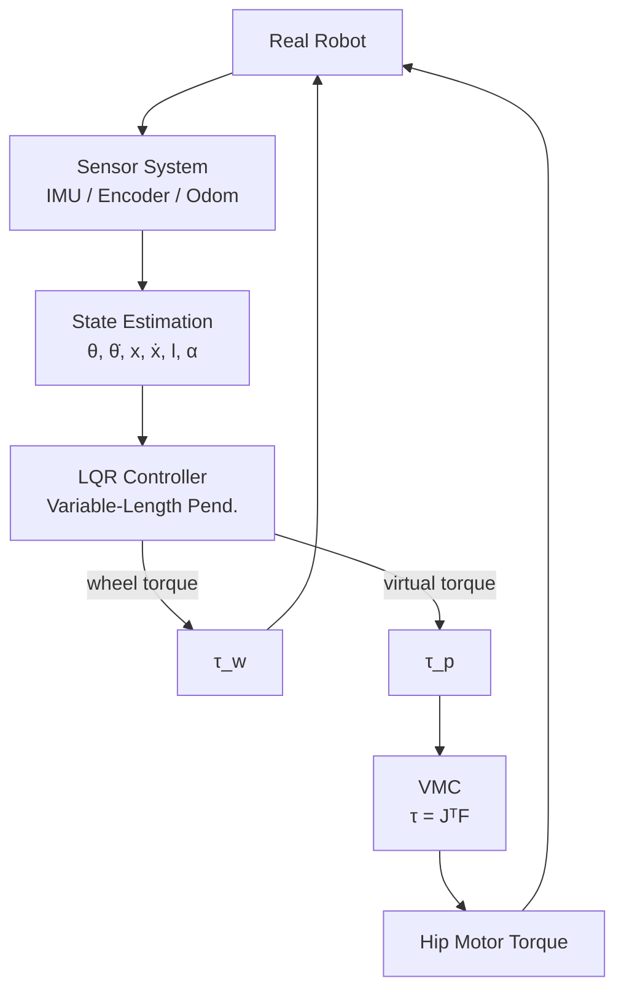

# 控制系统概述

轮腿构型机器人在赛场上因为构型原因，通常有更好的移动速度上限和地形跨越能力。纵观赛场历史，曾经出现过多种构型：**两轮构型**，**开链四连杆构型**，**并联构型**，**偏置并联构型**（也叫串联腿）。

## 系统概述

控制方面，机器人控制其实就是“**抽象 → 建模 → 简化 → 求解 → 映射**”的过程。通过物理层的抽象，此类机器人的本质都是轮式倒立摆结构。

控制系统大致可以概括为以下层级

## 约定

在腿式机器人的研发过程中，最容易出现错误的是正方向的约定与统一，如果出现某一个符号错误很有可能出现无法平衡，甚至能够平衡但是姿态很奇怪的情况（你猜我怎么知道的），所以我们应该对所有力的正方向进行统一，保证正确性。

>[!tip] 符号说明
>1. 统一左视图
>2. VMC符号约定：左视图朝左为 $x$ 轴正方向，朝下为 $y$ 轴正方向
>3. 物理建模符号约定：遵循前$x$，左$y$，上$z$的方向约定，即左视图逆时针为旋转相关量的正方向，向上为力的正方向

# VMC

# 物理建模与控制器

# 控制理论基础

这里只涉及最少的控制理论中与LQR强相关的前置知识，大部分属于现代控制理论。而经典控制理论和其某些概念是完全互通的，在这里不做涉及，对整个控制理论感兴趣的同学可以看《控制之美》
## 基础概念

>[!note] 动态系统（Dynamic System）
> 状态随时间变化的系统，特点为状态变量（State Variable）为时间的函数。

>[!note] 线性时不变系统（Linear Time Invariant System）
>1. 线性 : 指系统的输入和输出是线性映射的，符合叠加原理（Superposition Principle）
>2. 时不变性 : 指的是如果系统的输入信号延迟了时间T,那么系统的输出也会延迟时间T
## 卷积

对于线性时不变系统而言，系统的输入和输出之间是**卷积（convolution)** 的关系，即系统的输入和输出会对未来一段时间之内的系统输出产生影响。

e.g.: 扯一根弹簧，弹簧在t时刻的输出和(t-1)时刻的输出（即位移）和(t-1)时刻输入的力有关。

>[!note] 卷积
>$$
>x(t)=\lim_{ \Delta T \to \infty }\sum^n_{i=0} u(i\Delta T)\Delta Th_{\Delta}(t-i\Delta T)=\int^t_{0}u(\tau)h(t-\tau)d\tau=u(t)*h(t)
>$$

$x(t)$代表输出，$u(t)$代表输入，$h(t)$代表系统对于冲激函数$\delta(t)$的冲激响应（Impulse Response）。（简略来说，任意输入都可以表示成多个冲激信号的叠加，系统对每个冲激信号都有响应，就叫冲激响应）。详细的推导过程见《控制之美》卷1-2.1.1.

> [!tip] 
> 卷积也在图像处理方向（CV领域）被常见运用，如CNN(Convolution Neural Network)。CNN中的“卷积核”就是LTI系统中的冲激响应$h(t)$.因为图片是二维的，则CNN的每一层可以看作一个二维离散LTI系统，just for elaborate, 感兴趣的同学可以去看看。

## 状态空间方程

现代控制理论的核心工具，描述系统内部如何演化。状态空间方程是一个集合，包含了系统的输入、输出及状态变量，并把它们用一系列的一阶微分方程表达出来。

>[!note] 状态空间方程
>
>连续时间线性系统：
>$$
>\dot{\mathbf{x}} = A\mathbf{x} + B\mathbf{u}
>$$
>$$
 \mathbf{y} = C\mathbf{x} + D\mathbf{u}
>$$
>其中：
>- $\mathbf{x}$：状态（State）
>- $\mathbf{u}$：输入（Input）
>- $\mathbf{y}$：输出（Output）
>
矩阵：
>- $A$：系统矩阵，表示系统状态变量之间的关系
>- $B$：输入矩阵，表示输入对状态变量的影响
>- $C$：输出矩阵，表示系统的输出与系统状态变量之间的关系
>- $D$：直接传递矩阵，表示系统的输入直接作用在系统输出的部分

>[!abstract] 建模
>有了状态空间方程，有一个物理系统，我们应该如何建模？
> 1. 首先通过对系统的经典力学分析和动力学分析得到动态微分方程（如在弹簧-阻尼系统中$m\frac{d^2x(t)}{dt^2}+b\frac{dx(t)}{dt}+kx(t)=f(t)$）。
> 2. 其次选择状态变量，使得状态$x$满足$x(t_{0})+u(t\geq t_{0})$能够唯一确定$x(t)$和$y(t)$对于所有未来时刻即可。第一步中的建模精确性影响第二步的状态变量选择，也是后续不同建模的主要区别。
> 3. 然后则是根据第一步中列出的公式和状态变量$x(t)$，求解矩阵ABCD。

